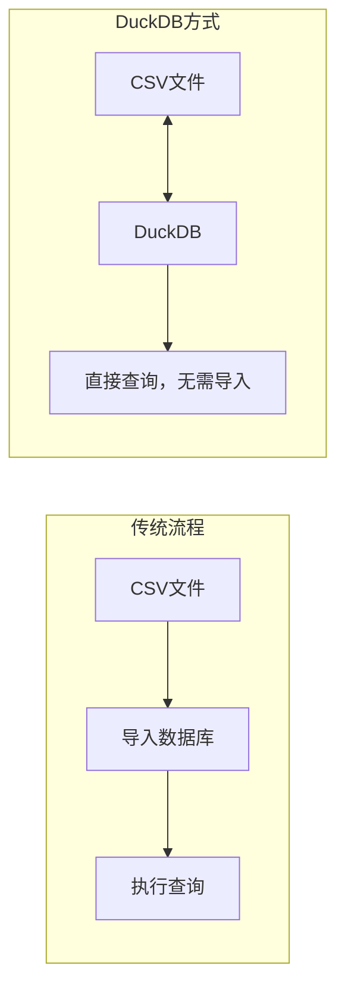
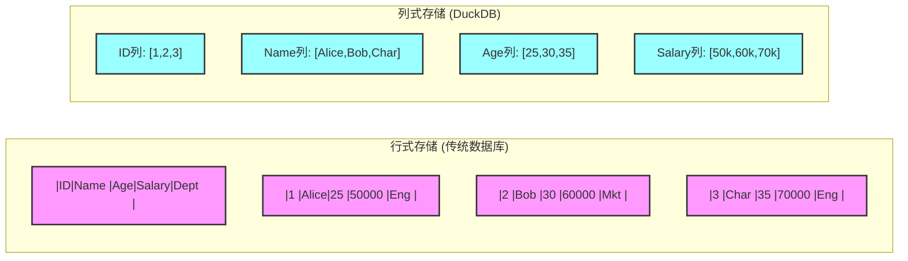
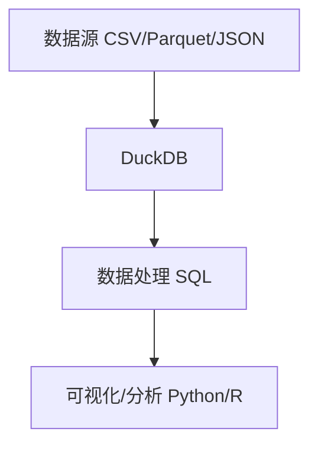
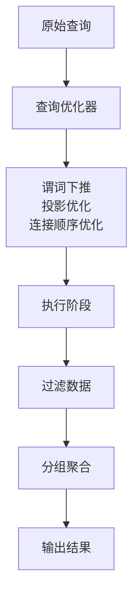
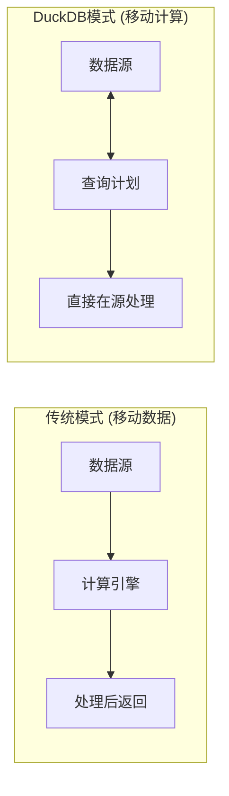

# DuckDB：现代分析数据库的重新构想

最近，我在一个数据科学项目中遇到了一个有趣的问题。我们有大量需要处理的CSV文件，每次都要导入到数据库中进行分析，这个过程既繁琐又耗时。直到我发现了DuckDB，这个轻量级但功能强大的数据库彻底改变了我的工作方式。

## 从SQLite到DuckDB：一次意外的发现

作为一个习惯了使用PostgreSQL和SQLite的开发者，我最初对DuckDB持怀疑态度。毕竟，我们已经有SQLite了，为什么还需要另一个嵌入式数据库？但当我尝试将10GB的Parquet文件直接查询时，DuckDB的表现让我震惊了。

"直接查询？不需要先导入？"这听起来像是不可能的事情，但DuckDB做到了。它不是简单地将文件加载到内存中，而是直接对文件进行查询，就像这些文件是数据库表一样。这种"查询即服务"的体验让我重新思考了数据处理的方式。



## 与众不同的架构理念

DuckDB的架构设计体现了对分析工作负载的深刻理解。与传统的行式数据库不同，它采用了列式存储，这意味着当你查询特定列时，数据库只需要读取相关数据，而不是整个行。这个看似简单的改变，却带来了性能的巨大提升。



更有趣的是，DuckDB使用了向量化执行引擎。传统数据库通常一次处理一行数据，而DuckDB一次可以处理几千行数据，充分利用现代CPU的向量指令集。这种批处理方式让查询速度有了质的飞跃。

## 嵌入式架构的巧妙之处

最吸引我的是DuckDB的嵌入式特性。它不是一个独立运行的服务，而是直接嵌入到你的应用程序中。这意味着什么？没有网络延迟，没有进程间通信开销，数据就在你的应用内存中。

```mermaid
graph TD
    subgraph "传统数据库 (如PostgreSQL)"
        A[应用程序] -- "TCP/IP" --> B[数据库服务]
        B -- "TCP/IP" --> A
    end
    
    subgraph "嵌入式数据库 (DuckDB)"
        C[应用程序]
        C --> D[DuckDB (库)]
        D --> E[内存数据 (共享)]
        E --> C
    end
```

想象一下，你正在用Python做数据分析。以前，你需要将pandas DataFrame转换为数据库格式，执行查询，再转换回来。现在，你可以直接在pandas DataFrame上执行复杂的SQL查询，而不需要任何数据移动。

```python
import duckdb
import pandas as pd

# 直接查询CSV文件，无需导入
df = duckdb.query("SELECT * FROM 'data.csv' WHERE age > 30").to_df()
```

这种便利性不仅仅是语法糖，它反映了DuckDB对现代数据科学工作流的深刻理解。

## 实际应用场景

在过去几个月的使用中，我发现DuckDB在几个场景下特别有用：

**数据清理和转换**：当你有一个复杂的ETL流程时，DuckDB的SQL方言比pandas的链式操作更直观。复杂的窗口函数、CTE、JSON处理等功能让数据转换变得简单。

**原型开发**：在开发数据产品时，DuckDB让我可以快速验证想法，无需设置完整的数据库环境。

**本地数据分析**：处理本地文件时，DuckDB的性能让我印象深刻。几GB的文件查询通常在几秒内完成。



## 独特的生态系统

DuckDB的另一个亮点是其丰富的扩展系统。它不仅支持标准的SQL功能，还提供了Parquet、JSON、HTTP等扩展，几乎涵盖了现代数据栈的所有主要组件。

更令人惊喜的是它的自动类型推断。你不需要定义表结构，DuckDB会自动推断CSV和Parquet文件的列类型。这种"开箱即用"的设计理念让数据分析师可以专注于数据本身，而不是技术细节。

## 性能的深度思考

DuckDB的性能不是靠增加复杂性实现的，而是通过优化设计。它的查询优化器会自动重写查询，将过滤条件推送到存储层，最小化需要处理的数据量。



但DuckDB并不是万能的。它专注于OLAP（在线分析处理）工作负载，而不是OLTP（在线事务处理）。如果你的场景是高并发的事务处理，DuckDB可能不是最佳选择。但它为"数据即代码"的开发模式提供了完美的基础。

## 重新思考数据处理

使用DuckDB让我重新思考了数据处理的方式。传统上，我们习惯于将数据移动到计算（将数据导入数据库进行处理），但DuckDB代表了另一种模式：将计算移动到数据（直接在原位置处理数据）。



这种模式在现代数据架构中变得越来越重要。数据量的爆炸性增长使得数据移动变得昂贵，而DuckDB的"就地查询"能力提供了一种更高效的方法。

## 展望未来

DuckDB的成功不仅仅是技术上的，更是理念上的。它证明了专业化数据库的价值：不是试图做所有事情，而是专注于特定领域并做到极致。

随着数据科学和机器学习的普及，我相信像DuckDB这样的专用数据库会变得越来越重要。它们为数据科学家提供了更自然的工具，让复杂的分析工作变得更加简单。

```mermaid
graph TB
    subgraph "客户端集成"
        A[Python pandas] 
        B[R dplyr] 
        C[JavaScript Node.js]
    end
    
    A --> D
    B --> D
    C --> D
    
    subgraph "DuckDB核心"
        D[DuckDB (嵌入式引擎)]
    end
    
    D --> E[支持多种格式]
    E --> F[Parquet, CSV, JSON]
    E --> G[外部系统连接]
```

DuckDB并不是要取代传统的数据库系统，而是要填补它们之间的空白。在一个数据驱动的世界里，我们需要各种各样的工具，而DuckDB为这个工具箱添加了一个非常实用的选择。

## 结语

从最初的怀疑到现在的依赖，DuckDB改变了我处理数据的方式。它不是最复杂的技术，也不是功能最全的系统，但它在正确的方向上做到了极致。对于任何需要进行数据分析的人来说，DuckDB都值得尝试。

更重要的是，DuckDB的成功提醒我们，在软件开发中，有时专注于解决特定问题比试图解决所有问题更有效。这个简单的理念，可能正是DuckDB能够从众多数据库中脱颖而出的原因。