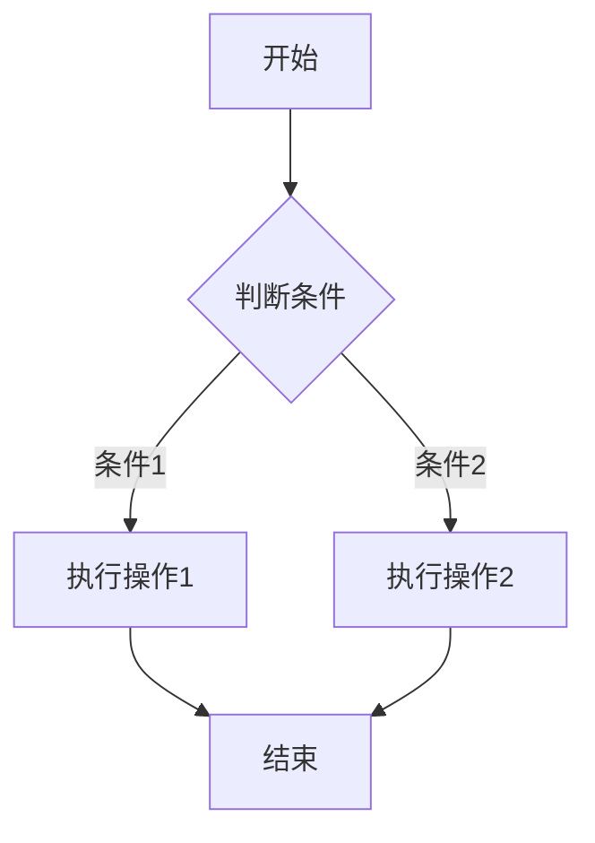
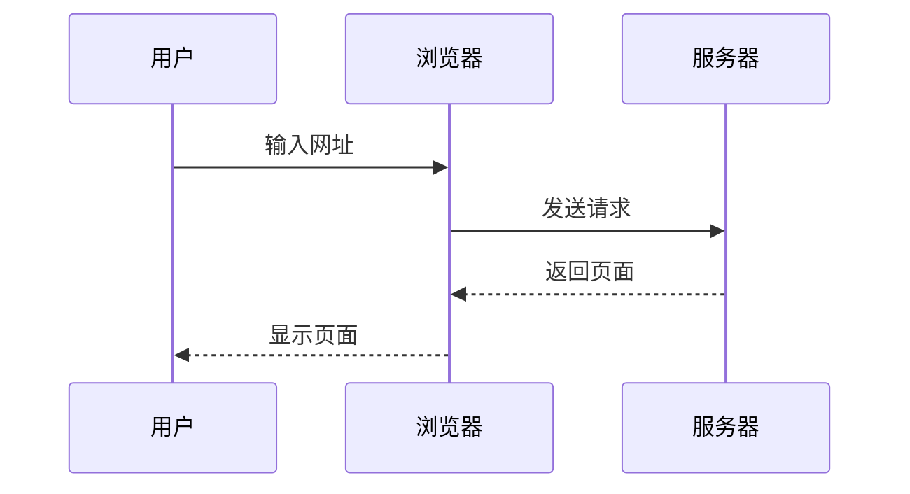

# 数学与图表功能测试

## 数学公式测试

这里是一些数学公式的测试：

行内公式：$E = mc^2$

独立公式：
$$\int_{-\infty}^{\infty} e^{-x^2} dx = \sqrt{\pi}$$

复杂公式：
$$\sum_{i=1}^{n} x_i = x_1 + x_2 + \cdots + x_n$$

## Mermaid 图表测试

## 更多数学公式示例

二次方程的求根公式：
$$x = \frac{-b \pm \sqrt{b^2 - 4ac}}{2a}$$

欧拉恒等式：
$$e^{i\pi} + 1 = 0$$

矩阵示例：
$$\begin{bmatrix} a & b \\ c & d \end{bmatrix}$$

## 结论

这个页面用于测试数学公式和图表功能是否正常工作。